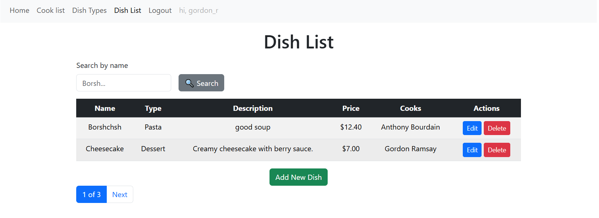

# Cafe kitchen service

Django project for managing dish and cookers in cafe

## Check it out

[Cafe project deployed to Render]

Python3 must be already installed
```shell
git clone https://github.com/diemonBil/cafe_kitchen_service
cd cafe_kitchen_service
python3 -m venv venv
source venv/bin/activate
pip install -r requirements.txt
python manage.py runserver # starts Django Server
```

## Features
* User Authentication.
Secure login and logout system with restricted access to data management for non-authenticated users.

* Dish Management with Search & Pagination.
Full CRUD operations for dishes with real-time search and paginated display for better usability.

* Cook Management.
Manage cooks through a clean, table-based interface with options to create, edit, and delete.

* Dish Type Categorization.
Organize dishes by type with an intuitive interface to add, edit, and remove categories.

* Responsive & Styled Frontend (Bootstrap + Crispy Forms).
Modern, responsive user interface using Bootstrap and Django Crispy Forms for consistent and clean form styling.

## Demo
